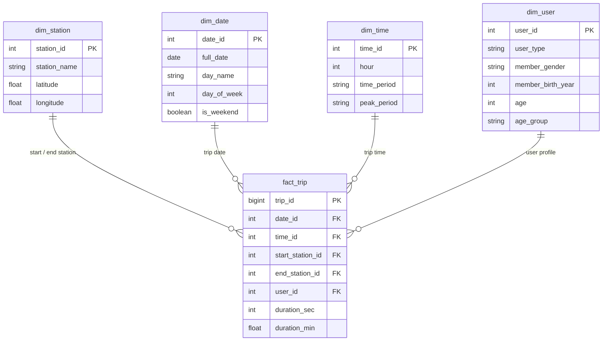

# 🚲 Ford GoBike Data Engineering & Mobility Analytics Platform


An enterprise-grade, end-to-end Data Engineering and Mobility Analytics platform built on the **Ford GoBike (Bay Wheels)** bike-sharing system.

The entire architecture is **100% cloud-native**, hosted on **Supabase PostgreSQL** with zero reliance on local CSV files. The platform manages data across four centralized warehouse layers (Bronze → Silver → Warehouse → Gold) and serves real-time operational mobility intelligence through a modular **Plotly Dash** application.

---

## 🏗️ Cloud Data Warehouse Architecture

All data layers, transformations, and analytical aggregations reside directly within the centralized **Supabase PostgreSQL** cloud instance:

```text
                  Supabase PostgreSQL Cloud
┌─────────────────────────────────────────────────────────────┐
│                                                             │
│   Bronze Layer (Raw Storage: bronze.trips)                  │
│        ↓                                                    │
│   Silver Layer (Cleaned & Validated: silver.trips)          │
│        ↓                                                    │
│   Warehouse Layer (Star Schema: fact_trip + Dimensions)     │
│        ↓                                                    │
│   Gold Layer (Analytics SQL Views: gold.trip_analytics)     │
│                                                             │
└──────────────────────────────┬──────────────────────────────┘
                               │ SQLAlchemy Cloud Connection
                               ↓
             Interactive Mobility Dashboard (Plotly Dash)
```

### Data Layers Overview

| Layer | Schema / Table | Purpose & Details |
| :--- | :--- | :--- |
| **Bronze** | `bronze.trips` | Stores full fidelity raw ride data directly in Supabase. |
| **Silver** | `silver.trips` | Type-standardized, validated, and enriched records (duration minutes, member age, age groups, temporal features). |
| **Warehouse** | `warehouse.*` | Production **Star Schema** containing `warehouse.fact_trip` joined to dimension tables (`dim_station`, `dim_user`, `dim_date`, `dim_time`). |
| **Gold** | `gold.trip_analytics` | High-performance aggregated SQL views created directly inside Supabase to power analytical queries and UI components. |

---

## 🏛️ Dimensional Model (Star Schema)

The analytical warehouse is organized as a Star Schema to guarantee high-performance analytics, fast joins, and eliminate data redundancy:



---

## ⚙️ Cloud ELT Pipeline

The data transformation and warehouse build pipeline is orchestrated via `pipeline/pipeline.py` connecting directly to Supabase via SQLAlchemy:

```text
Connect (Supabase PostgreSQL via SQLAlchemy Engine)
   ↓
Read Raw Data (bronze.trips)
   ↓
Transform & Cleanse Data
   ↓
Load Cleaned Data (silver.trips)
   ↓
Populate Dimension Tables (dim_date, dim_time, dim_station, dim_user)
   ↓
Populate Fact Table (fact_trip)
   ↓
Create / Refresh Gold Views (gold.trip_analytics)
   ↓
Pipeline Validation & Health Check
```

---

## 🔬 Key Empirical Findings & Analytics

Analyzing **183,416+ trips** in the Gold Layer revealed critical operational patterns:

| Insight Domain | Finding | Operational & Business Takeaway |
| :--- | :--- | :--- |
| **User Hierarchy** | **89.2%** Subscribers vs. **10.8%** casual Customers. | The network functions as an essential daily commute service rather than tourist leisure. |
| **Duration Paradox** | Customers average **21.9 mins** per trip; Subscribers average **10.7 mins**. | Casual riders explore recreationally; subscribers prioritize transit speed and efficiency. |
| **Peak Commute Pulses** | Heavy bimodal weekday peaks at **8:00–9:00 AM** and **5:00–6:00 PM**. | Fleet maintenance windows must be scheduled during midday and late-night lulls. |
| **Transit Arteries** | Top origin and destination hubs connect directly to BART & Caltrain lines. | Bike-sharing serves as the vital "first-mile / last-mile" link in Bay Area public transit. |
| **Dock Rebalancing** | Heavy dock depletion in residential zones; surplus accumulation at commercial transit hubs. | Deploy proactive van-dispatch rebalancing during morning and evening commute windows. |

---

## 📁 Repository Structure

```text
ford_gobike_analysis/
│
├── dashboard/
│   ├── master-dashboard/
│   │   ├── app.py                      # Master Plotly Dash application entry point
│   │   ├── config.py                   # App configuration & theme settings
│   │   ├── data_loader.py              # Cloud data loader querying Supabase directly
│   │   ├── layout.py                   # Main layout container
│   │   ├── callbacks/                  # Interactive Dash callbacks
│   │   │   ├── global_filter_sync.py
│   │   │   ├── overview_callbacks.py
│   │   │   └── routing.py
│   │   ├── components/                 # UI components, layout bars, & KPI cards
│   │   │   ├── global_filter_bar.py
│   │   │   ├── kpi_banner.py
│   │   │   └── navbar.py
│   │   ├── assets/
│   │   │   └── master_style.css        # Dashboard styling & dark theme
│   │   ├── pages/                      # Multi-page modular layouts
│   │   └── Procfile                    # Deployment configuration
│   │
│   ├── station-trip-analysis/          # Station & Route flow analysis module
│   ├── time-user-analysis/             # Time-series & User demographic module
│   └── database.py                     # Centralized SQLAlchemy connection to Supabase
│
├── pipeline/
│   ├── __init__.py
│   ├── extract.py                      # Supabase Bronze layer extractor
│   ├── transform.py                    # Silver cleansing & feature engineering
│   ├── load.py                         # Star Schema warehouse builder
│   └── pipeline.py                     # Master ELT orchestrator
│
├── database/
│   ├── bronze/
│   │   └── create_tables.sql           # Bronze table schema (bronze.trips)
│   ├── silver/
│   │   └── create_tables.sql           # Silver table schema (silver.trips)
│   ├── warehouse/
│   │   ├── dimensions.sql              # Dimensions DDL (dim_date, dim_station, etc.)
│   │   └── facts.sql                   # Fact table DDL (fact_trip)
│   └── gold/
│       └── views.sql                   # Analytical views (gold.trip_analytics)
│
├── eda/
│   └── notebooks/                      # Exploratory Data Analysis notebooks
│       ├── EDA_adam.ipynb
│       ├── EDA_youssef.ipynb
│       ├── EDA_Taspeeh.ipynb
│       └── EDA_Tspeeh_Time_User.ipynb
│
├── preprocessing/
│   └── preprocessing.ipynb             # Feature engineering & transformation research
│
├── requirements.txt                    # Project dependencies
└── README.md
```

---

## 🚀 Quickstart & Setup Guide

### 1. Clone the Repository
```bash
git clone https://github.com/adamelhabian/Depi-Projects-AI.git
cd Depi-Projects-AI/Data-Analysis/ford_gobike_analysis
```

### 2. Set Up Virtual Environment
```bash
# Windows
python -m venv .venv
.venv\Scripts\activate

# macOS / Linux
python3 -m venv .venv
source .venv/bin/activate
```

### 3. Install Dependencies
```bash
pip install -r requirements.txt
```

### 4. Configure Supabase Cloud Connection
Create a `.env` file in the root directory (or in `dashboard/master-dashboard/.env`):
```env
DATABASE_URL=postgresql://postgres:[YOUR-PASSWORD]@[YOUR-SUPABASE-HOST]:5432/postgres
```

### 5. Run the Cloud ELT Pipeline (Optional if DB is already loaded)
```bash
python pipeline/pipeline.py
```

### 6. Launch the Interactive Dashboard
```bash
python dashboard/master-dashboard/app.py
```
Open your browser and navigate to: **`http://127.0.0.1:8050`**

---

## 👥 Contributors & Roles

Developed collaboratively as part of the **DEPI Data Analysis & Engineering Program**:

| Contributor | Focus Area & Responsibilities | Links |
| :--- | :--- | :--- |
| **Youssef Mohamed Abdelkrem** | Station & Trip Flow Analytics, Spatial Mapping & Dash UI | [](https://github.com) [](https://linkedin.com) |
| **Adam Elhabian** | Cloud ELT Pipeline & Ingestion Architecture | [](https://github.com) [](https://linkedin.com) |
| **Mina Safwat** | Data Warehouse Architecture & Star Schema Modeling | [](https://github.com) [](https://linkedin.com) |
| **Maya Amged** | Gold Layer Analytics & SQL View Optimizations | [](https://github.com) [](https://linkedin.com) |
| **Tasbeeh Hassan** | Time-Series & Demographic Analysis | [](https://github.com) [](https://linkedin.com) |
