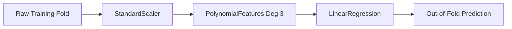

# PART 2 — Modeling & Optimization (Boston Housing Price Prediction)

Welcome to the documentation for **PART 2: Modeling & Optimization** of the Boston Housing Regression project. This module develops, validates, tunes, and evaluates predictive regression models to estimate median home values (`MEDV`).

---

## 📌 Executive Summary

Building on the exploratory findings of Part 1, Part 2 implements an end-to-end, leakage-free machine learning workflow using **scikit-learn Pipelines** and **5-Fold Cross-Validation**. 

Seven regression models across parametric, tree-based, and ensemble families were evaluated. Following the **1-Standard-Deviation / 1-SE Parsimony Rule**, **Polynomial Regression (Degree 3)** was programmatically selected as the champion model for its optimal balance of predictive power, interpretability, and closed-form stability.

```
       5-Fold CV R²: 0.8294 ± 0.0230 | CV RMSE: $69,065 ± $6,663
       Final Test R²: 0.8223         | Test RMSE: $62,498.28 | Test MAE: $48,324.78
```

---

## 📂 Dataset & Target

The dataset resides at `ML/ML_P1/data/boston_housing_cleaned.csv` (489 rows, 4 columns).

| Feature | Type | Physical Meaning |
| :--- | :---: | :--- |
| `RM` | `float64` | Average number of rooms per dwelling |
| `LSTAT` | `float64` | Percentage of lower status population |
| `PTRATIO` | `float64` | Pupil-teacher ratio by town |
| **`MEDV`** *(Target)* | `float64` | Median value of owner-occupied homes (in $) |

### Train / Test Split
- **Split Ratio:** 80% Training (391 samples) / 20% Testing (98 samples).
- **Random Seed:** Fixed `random_state=42`.
- **Integrity Protocol:** The test set (`X_test`, `y_test`) was quarantined and evaluated **only once** at the conclusion of the modeling phase.

---

## 🛡️ Pipeline Architecture & Data Leakage Prevention

To avoid train-validation data leakage:
1. **Dynamic Scaling:** `StandardScaler` is wrapped inside an `sklearn.pipeline.Pipeline` for all linear and polynomial estimators. During cross-validation, scaling statistics ($\mu, \sigma$) are computed **strictly on the training folds**.
2. **Scale Invariance:** Tree-based models (`DecisionTreeRegressor`, `RandomForestRegressor`, `GradientBoostingRegressor`) bypass feature scaling.
3. **Out-of-Fold Diagnostics:** All validation diagnostic plots utilize `cross_val_predict` out-of-fold estimates rather than in-sample training predictions.



---

## 🔬 Models Evaluated

Seven regression algorithms were evaluated across 4 distinct model families:

1. **Linear Regression (Parametric Baseline):** Ordinary Least Squares on scaled features.
2. **Polynomial Regression (Non-Linear Expansion):** Quadratic and cubic polynomial interactions ($\binom{3+d}{d}-1$ terms).
3. **Ridge Regression (L2 Regularization):** Shrinkage penalty $\lambda \sum w_j^2$.
4. **Lasso Regression (L1 Regularization):** Sparsity-inducing penalty $\lambda \sum |w_j|$.
5. **Decision Tree Regressor (Non-Parametric):** Hierarchical decision boundaries.
6. **Random Forest Regressor (Bagging Ensemble):** Variance reduction across 100–200 trees.
7. **Gradient Boosting Regressor (Boosting Ensemble):** Sequential pseudo-residual fitting.

---

## 📊 Cross-Validation & Tuning Results

Hyperparameters were systematically optimized using `GridSearchCV` on the training folds (`scoring='neg_root_mean_squared_error'`).

### Tuned 5-Fold Cross-Validation Performance Table

| Rank | Model | Best Hyperparameters | CV $R^2$ (Mean ± Std) | CV RMSE (Mean ± Std) | CV MAE (Mean ± Std) |
| :---: | :--- | :--- | :---: | :---: | :---: |
| 1 | **Gradient Boosting** *(Benchmark)* | `learning_rate=0.05, max_depth=3, n_estimators=100` | $0.8319 \pm 0.0204$ | $\$68,593 \pm \$6,355$ | $\$50,653 \pm \$3,712$ |
| 2 | **Polynomial Regression (Deg 3)** *(Champion)* | `poly__degree=3` (19 features) | **$0.8294 \pm 0.0230$** | **$\$69,065 \pm \$6,663$** | **$\$52,701 \pm \$4,547$** |
| 3 | **Random Forest** | `max_depth=6, min_samples_split=5, n_estimators=200` | $0.8293 \pm 0.0214$ | $\$69,201 \pm \$7,318$ | $\$51,471 \pm \$4,116$ |
| 4 | **Decision Tree** | `max_depth=4, min_samples_leaf=4, min_samples_split=2` | $0.8042 \pm 0.0353$ | $\$73,857 \pm \$8,745$ | $\$54,411 \pm \$5,736$ |
| 5 | **Lasso** | `alpha=1000.0` | $0.7134 \pm 0.0582$ | $\$89,485 \pm \$13,290$ | $\$66,844 \pm \$8,564$ |
| 6 | **Ridge** | `alpha=1.0` | $0.7133 \pm 0.0586$ | $\$89,485 \pm \$13,344$ | $\$66,851 \pm \$8,533$ |
| 7 | **Linear Regression** | Default OLS | $0.7133 \pm 0.0587$ | $\$89,487 \pm \$13,367$ | $\$66,854 \pm \$8,537$ |

---

## 🎯 Model Selection: The 1-SE Parsimony Rule

To prevent data snooping, the champion model was selected **programmatically strictly prior to test-set evaluation** using the classic 1-Standard-Error rule (Hastie et al.):

$$\text{Select simplest model where: } \mu_{R^2} \ge \mu_{R^2,\text{top}} - \text{SE}_{\text{top}}$$

- **Top Model:** Gradient Boosting ($\mu_{R^2} = 0.8319$, $\sigma = 0.0204$, $\text{SE} = \frac{0.0204}{\sqrt{5}} \approx 0.0091$).
- **Difference:** $|\mu_{GB} - \mu_{Poly}| = |0.8319 - 0.8294| = 0.0025 \le 0.0091$.
- **Verdict:** Because the performance gap is well within random cross-validation noise, **Polynomial Regression (Degree 3)** is programmatically selected over complex 100-tree ensembles. It offers closed-form deterministic computation, 19 explicit coefficients, and instant inference latency.

---

## 🏁 Final Unseen Test Set Evaluation

The champion model was refit on the full training set (`X_train`, `y_train`) and evaluated **once** on the quarantined test set:

| Role | Model | Test $R^2$ | Test RMSE | Test MAE | Test MSE |
| :--- | :--- | :---: | :---: | :---: | :---: |
| 🏆 **Selected Champion** | **Polynomial Regression (Deg 3)** | **0.8223** | **$62,498.28** | **$48,324.78** | $3,906,035,332.82$ |
| 📊 *Report-Only Benchmark* | *Gradient Boosting* | *0.8481* | *$57,778.58* | *$44,487.79* | *$3,338,363,771.19* |

---

## 📈 Model Diagnostics & Explainability

### 1. Permutation Feature Importance
Evaluates the drop in test $R^2$ when shuffling feature values across 30 iterations:
- **`LSTAT` (Mean Drop: 0.7392):** Dominant driver of home valuation. Neighborhood poverty/lower-status proportion exerts a non-linear downward compounding effect.
- **`RM` (Mean Drop: 0.4066):** Primary positive scaling factor. Each additional room systematically increases dwelling value.
- **`PTRATIO` (Mean Drop: 0.1006):** Moderate secondary factor. Higher student-to-teacher ratios moderately reduce valuation.

### 2. Residual Statistical Validation
- **Histogram & KDE:** Symmetrically centered near zero (Mean error: $-\$9,434.71$).
- **Normal Q-Q Plot:** Residuals conform to the normal theoretical diagonal with mild positive skew ($0.657$) and near-normal tail weight (Kurtosis: $0.994$), satisfying classical linear model assumptions.

### 3. Sample Complexity (Learning Curves)
- 5-Fold cross-validation learning curves demonstrate that the validation error converges smoothly toward the training error as sample size exceeds 250 observations. The $N=391$ training samples provide sufficient constraint for the 19 polynomial parameters.

---

## 🤝 Team Handover: API & Form Validation Contracts

To protect the model against **polynomial extrapolation divergence**, the Frontend Form and Backend API schemas (e.g., Pydantic / serializers) should enforce the following validation bounds:

| Feature | Meaning | Data Type | Min | Median | Max | Recommended UI / API Bounds | Step |
| :--- | :--- | :---: | :---: | :---: | :---: | :---: | :---: |
| `RM` | Rooms per dwelling | `float` | 3.56 | 6.21 | 8.78 | `[3.0, 9.0]` | 0.1 |
| `LSTAT` | % Lower status population | `float` | 1.73 | 11.36 | 37.97 | `[1.0, 40.0]` | 0.5 |
| `PTRATIO` | Pupil-teacher ratio | `float` | 12.60 | 19.00 | 22.00 | `[10.0, 25.0]` | 0.5 |

---

## 🚀 How to Run the Notebook

```bash
# 1. Install dependencies
pip install -r ML/ML_P1/src/requirements.txt

# 2. Run the notebook using Jupyter
jupyter notebook "ML/ML_P1/src/ml/MLpart2/MLPhase2.ipynb"
```

---

## 👤 Author & Course Information
- **Author:** Youssef Mohamed
- **Track:** DEPI R5 — Machine Learning Specialization
- **Project:** Boston Housing Price Regression (Part 2 — Modeling & Optimization)
